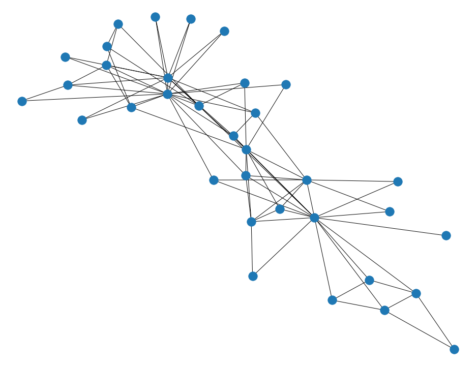
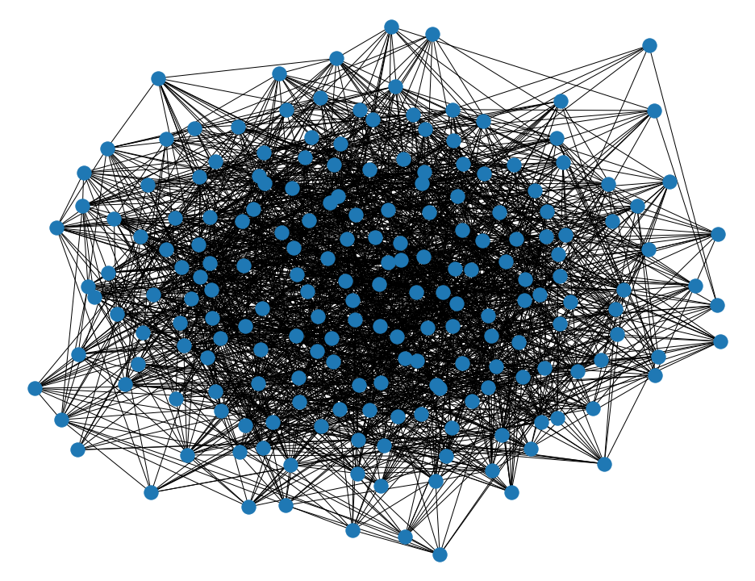

# Network Analysis: Assignment 2

Second assignment of the network analysis course

## Part 1

For the first part of the assignment we performed the experiments of the option 1, which plans to perform *robustness* test on small synthetic graphs.
The tests of the robustness are performed simulating different types of attack, removing nodes according to the listed critera:

- **Higest betweenness**.
- **Highest degree nodes**.
- **Higest pagerank**.
- **Random Nodes**.

The robustness is given by the current size of the diameter and the giant component, which are measured every time a node is removed from the network 

  

### Karate Club Graph
The first graph we treated is the already known **Zachary’s Karate Club** graph, which represent a social network of a university karate club. This network is composed of 34 nodes ( member of a karate club ), and there are links between pairs of members who interacted in and outside the club.

 <figure align=center>
       
       <figcaption> <i> Figure 1 - Karate Club Graph </i> </figcaption>
  
 </figure>
      
        
            
| Dataset statistics | Values |
|--------------------|------- |
| Nodes | 34                |
| Edges | 78               |
| Average Degree | 4.58     |
| Average clustering | 0.57  |
| Global clustering |    0.25 |
| Nodes giant component| 34 |
| Diameter |               5  |
| Average shortest path | 2.40|
| Density |         0.13      |
| Assortativity |     -0.47    |
      

The figure below on the left shows the relative size of the **giant component** (computed by dividing the size of the giant component with the size of the original graph, since the network is connected) as the nodes of the graph are sequentially removed.
The networks is more robust against *random failure*, and in such case the critical threshold  is more and less 0.7. 

By contrast the network seems to be very vulnerable to all the *target attacks* with a . With high degree, betweenness and Pagerank attacks the behavior is the same, and they also overlap in some part.

The figure on the right shows how the **diameter** changes depending on the type of network attack. Again, the targeted attacks breaks apart the network in a few steps,  we have a small increase in diameter at the beginning, but then decrease at , going from 6 to 0 very rapidly. 
The random attack takes more steps to disaggregate the network, in which we have an increse of the diameter before  and then there is a drastic decreasement of the diameter which goes rapidly to zero.
The initial encreasment is due to selection of the largest subgraph when the network is not connetced anymore.
<table><tr>
<td>  </td>
<td>  </td>
</tr></table>

Even if it is a very small network it shows a behaviour as it is a power-law one, in fact it is dissassortative and to connect the nodes relies on a few hubs.

###  Erdős–Rényi Random Graph

The second synthetic graph is a random graph, generated with the the Erdős–Rényi model.

<figure align=center>
    
    <figcaption> <i> Figure 2 - Erdős–Rényi Random Graph - N = 200, p = 0.1 </i> </figcaption>
</figure>

| Dataset statistics | Values |
|--------------------|------- |
| Nodes | 200                |
| Edges | 2017               |
| Average Degree | 20.17     |
| Average clustering | 0.09  |
| Global clustering |    0.10 |
| Nodes giant component| 200 |
| Diameter |               3  |
| Average shortest path | 2.01|
| Density |         0.10     |
| Assortativity |     0.03    |

This kind of network behaves very differently: The plot below of the **giant component** (on the left) shows that the Erdős–Rényi random graph we made is robust against failures of all the types we tested. The size of the giant component decreases monotonically with all the attacks, but also here the targeted attacks break apart the giant component more rapidly.

As in the case of the Karate Club network, the network is more robust against the random attack with a critical threshold  equal to more or less 0.9. With the target attacks, instead, we have at most . But it requires that most of nodes should be removed.

The plot on the right represent the **diameter** variations, also here it's clear that the network is more robust to random attack, in fact, the diameter does't change much, it oscillates in a small range ( roughly [ 0.4 - 0.5 ] ), untill to , where there is a small increase, and then, it decreases at . 

On the other hand, with the target attacks, instead, the diameter continues to increase untill , and then, goes quickly to 0. This means that, the target attacks, attack the interconectedness of the netowk, and hence also the ability of two nodes to communicate with each other, by increasing the lengh of the path between two nodes that want communicate.

<table><tr>
<td>  </td>
<td>  </td>
</tr></table>

## Part 2

### Facebook Circles Combined

<table><tr>
<td>  </td>
<td>  </td>
</tr></table>

We performed the same experiments on the Facebook dataset we already used in the first assignment. Sice this network is very large, the experiments are made removing 10 nodes at times, otherwise the execution would take too long.
This network is scale-free, and hence is more vunerable to the target attacks, especially with the betweeness attack, with which there is, even with a few nodes removed, a drastic reduction of the giant component. Here the citical threshold, , is between 0.1 and 0.2, instead, with the page rank and high degree node attacks are respectively, more or less, 0.3 and 0.4. On the other hand, the network is more robust to random attack, in fact, in order to destroy the giant component, it is necessary remove more ore less the 80% of the node in the network (  ).
From point of view of the diameter, the pagerank attack and the high degree attack have a significantly impact on the diameter, in fact, with this kinds of attacks there is a great increasement of the diameter, before becoming 0, and hence this means a significant impact on the avarage shortest path and therefore also in the ability of two nodes to communicate.
With the betweeeness attack, there is a peak at the beginning, and then a quick decreasment. As in the previous network, the a random attack is the one that affect less the diameter, in fact, it oscillates in a small range untill 0.5, and then, when the number of nodes removed in significant, the diameter increase, reaching the peak at . Also here, after the peak, there is a rapid decline towards 0.
