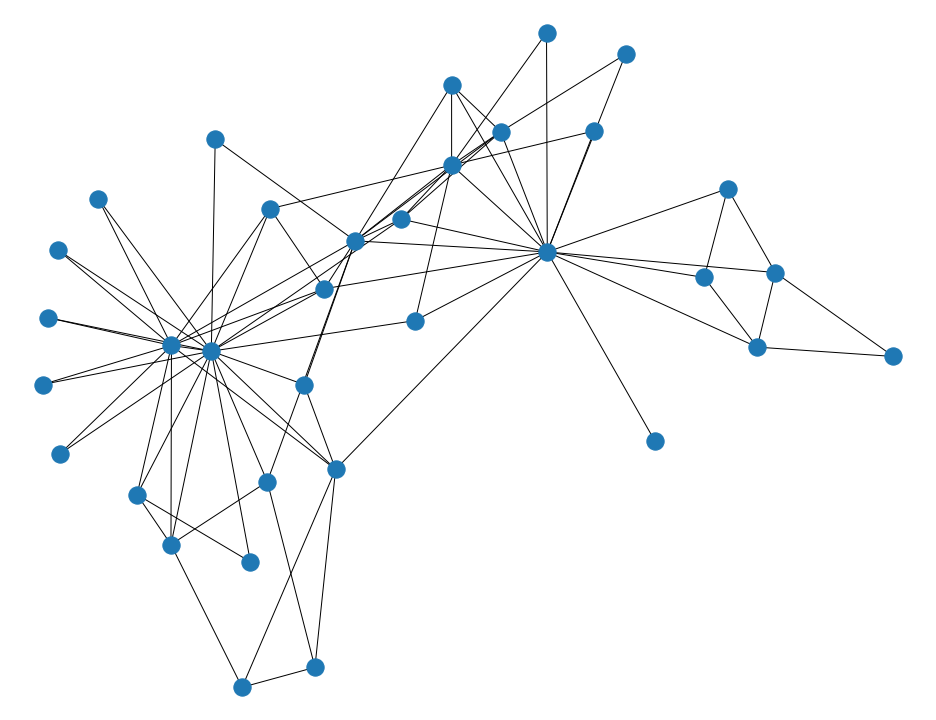
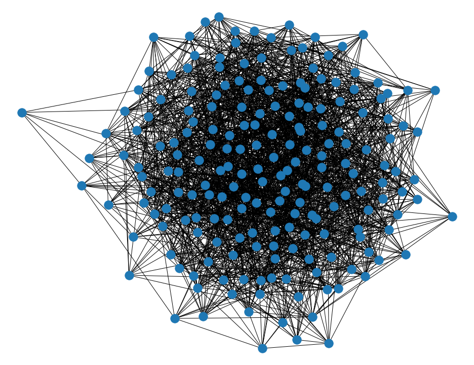

# Network Analysis: Assignment 2

Second assignment of the network analysis course

## Part 1

For the first part of the assignment we performed the experiments of the option number 1, which plans to perform robustness test on small graph.
The tests of the robustness are performed simulating different types of attack, turning off nodes with some critera:

- **Higest betweenness**.
- **Highest degree nodes**.
- **Higest pagerank**.
- **Random Nodes**.

For each of the above techniques is performed the test of the robustness as following: fixed one the tecniques, is choosen the node and it is removed, and then is saved the current size of the giant componte and the diameter. After the tests are executed for each technique are plotted the results in order to compare the behavior of the networks with different kind of attacks.

  

### Karate Club Graph
The first, showed in *figure 1*, is the already known **Zachary’s Karate Club** graph, which is a social network of a university karate club. This network is composed by 34 nodes ( member of a karate club ), and there are links between pairs of members who interacted outside the club.

<figure align=center>
    
    <figcaption> <i> Figure 1 - Karate Club Graph </i> </figcaption>
  
</figure>

The figure above on the left shows the relative size of the giant component (computed by dividing the size of the giant component with the size of the original graph, since the such a network is connected) as the nodes of the graph are sequentially removed.
The networks is more robust against random failure, and in such case the critical threshold  is more and less 0.6. By contrast the network seems to be very vulnerable to all the target attacks with a .
<table><tr>
<td>  </td>
<td>  </td>
</tr></table>

###  Erdős–Rényi Random Graph

The second graph we used is a random graph, generated with the the Erdős–Rényi model

<figure align=center>
    
    <figcaption> <i> Figure 2 - Erdős–Rényi Random Graph - N = 200, p = 0.1 </i> </figcaption>
</figure>

<table><tr>
<td>  </td>
<td>  </td>
</tr></table>

## Part 2

### Facebook Circles Combined

<table><tr>
<td>  </td>
<td>  </td>
</tr></table>

We performed the same experiments on the Facebook dataset we already used in the first assignment.